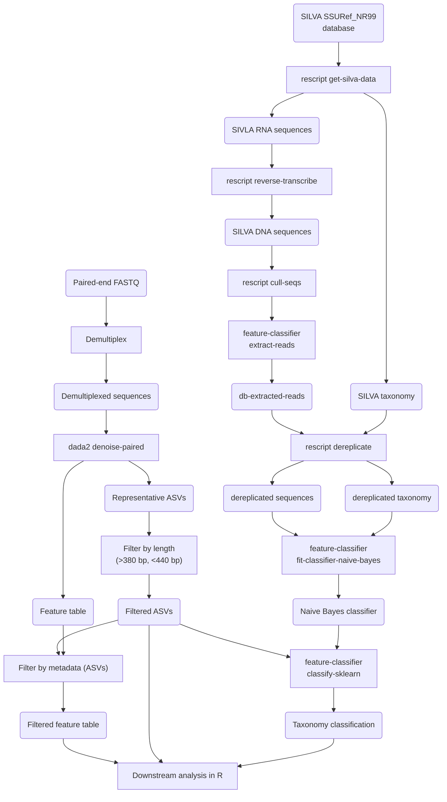

# 16S rRNA gene sequencing analysis of the naked mole-rat gut microbiota
TODO: change [](https://doi.org/10.5281/zenodo.18454971)
# TODO: Add env.yaml file
# TODO: Add R sessionInfo()
# Add markdown files and final report
# Add Figure screenshots

## Getting started
```sh
git clone https://github.com/amir-rakhimov/amplicon_nmr.git
wget https://data.qiime2.org/distro/amplicon/qiime2-amplicon-2024.2-py38-linux-conda.yml \
    -O $HOME/qiime2-amplicon-2024.2-py38-linux-conda.yml
mamba env create -n qiime2-amplicon-2024.2 --file $HOME/qiime2-amplicon-2024.2-py38-linux-conda.yml

# Install SRA-Toolkit
curl https://ftp-trace.ncbi.nlm.nih.gov/sra/sdk/current/sratoolkit.current-ubuntu64.tar.gz \
    --output $HOME/sratoolkit-current.tar.gz
gunzip $HOME/sratoolkit-current.tar.gz
mkdir $HOME/sratoolkit
tar -xvf $HOME/sratoolkit-current.tar -C $HOME/sratoolkit
mv $HOME/sratoolkit/* $HOME/
rmdir $HOME/sratoolkit/

bash run-pipeline.sh

## Create symlink for latest results
Rscript run-analysis.R
```

## Description  
This repository contains scripts and metadata related to the analysis of 
16S rRNA gene sequencing data from naked mole-rats and other rodents. 
Data from naked mole-rats and mice was generated at Kumamoto University and
Chiba Cancer Center Research Institute; data
from other hosts was taken from previous publications.

The R scripts were converted into R markdown files and knitr files, which can
be found in the markdown/ directory. The final report is _main.html

Scripts and metadata related to whole metagenome sequencing and MAG assembly can
be found in the other repository: https://github.com/amir-rakhimov/metagenome/

## Installation  
QIIME2 v2024.2 was run in a mamba environment. You'll also need sratoolkit, FastQC, and MultiQC  

Statistical analysis in R requires the following R (v4.4.3) and Bioconductor (v123) packages: 
* tidyverse
* ggrepel
* ggtext
* Polychrome
* phyloseq
* qiime2R
* vegan v2.6-4
* ALDEx2
* ANCOMBC
* Maaslin2

### Tested on:
- Ubuntu 22.04  
- QIIME2 2024.2  
- q2-DADA2 v2024.2.0  
- RStudio v2023.12.1+402   
- R v4.4.3 (2025-02-28 ucrt)   

# Input 
## Raw sequencing data:
* Naked mole-rat and mouse samples generated in this study: PRJNA1405902  
* Damaraland mole-rat samples: PRJNA781121  
* Lesser blind mole-rat samples: PRJNA607251  
* European brown hare and European rabbit samples: PRJNA576096  

## Metadata:
* Naked mole-rat and mouse metadata: `metadata/yasuda/filenames-paired.tsv`
* Damaraland mole-rat: `metadata/bensch/filenames-paired.tsv`  
* Lesser blind mole-rat samples: `metadata/sibai/filenames-paired.tsv`  
* European brown hare and European rabbit samples: `metadata/shanmuganandam/filenames-paired.tsv`  

In addition, you need naked mole-rat age metadata: `metadata/shared/ages.tsv`

# Usage
## QIIME2 pipeline  


Run the master script `run-pipeline.sh` **in the root directory**. The `.slurm` scripts in
`code/slurm-scripts/` correspond to the `.sh` scripts in `code/bash-scripts/`. SLURM
scripts only submit shell scripts to the HPC. 

The scripts used for QIIME2 pipeline are:  
1. `code/bash-scripts/001-get-fastq-files.sh` downloads FASTQ files from other studies.  
2. `qiime2-import-datasets` imports sequencing runs separately and trims primers with `q2-cutadapt`.  
3. `qiime2-test-trunc_len` tests different DADA2 truncation parameters with `q2-dada2`.  
4. `qiime2-train-classifier` trains a Naive Bayes classifier on SILVA database with `q2-feature-classifier`.  
5. `qiime2-merge-data-and-classify` merges QIIME2 artifacts from different sequencing runs 
and classifies ASVs using the Naive Bayes classifier.  

## Data analysis in R   
You can run each `.R` script in `code/r-scripts/` or get a combined bookdown report by running 
`run-analysis.R` **in the root directory**. The R scripts used are:
1. `001-phyloseq-qiime2.R` imports QIIME2 artifacts and converts them into `phyloseq` objects.  
2. `002-summary-stats-qiime2.R` Calculates various summary statistics on the imported dataset.  
3. `003-compare-data.R` imports processed ASV tables from original datasets and compares with our results.  
4. `004-barplots-qiime2.R` creates taxonomic barplots.  
5. `005-pca.R` creates PCA plots.  
6. `006-alpha-diversity.R` performs alpha diversity analysis.  
7. `007-diffabund-tests.R` performs differential abundance analyses with MaAsLin2, ALDEx2, and ANCOM-BC.  
8. `008-diversity-inside-custom-host.R`  
9. `make-figures.R` **in the root directory** prepares figures used in the publication.  


## Publications
Original publication: Diversity and stability of the gut microbiome of naked mole-rat 
(Heterocephalus glaber), the longest-lived rodent  
Amir Rakhimov, Noriko Yasuda-Yoshihara, Masanori Arita, Kazuhiro Okumura, Yoshimi Kawamura, 
Kaori Oka, Hiroshi Mori, Yuichi Wakabayashi, Yoshifumi Baba, Hideo Baba, Kyoko Miura  
bioRxiv 2026.02.16.704739; doi: https://doi.org/10.64898/2026.02.16.704739

Zenodo data: Rakhimov, A., Yasuda, N., Arita, M., & Miura, K. (2026). 
The metagenome of the naked mole-rat [Data set]. Zenodo. https://doi.org/10.5281/zenodo.18454971

